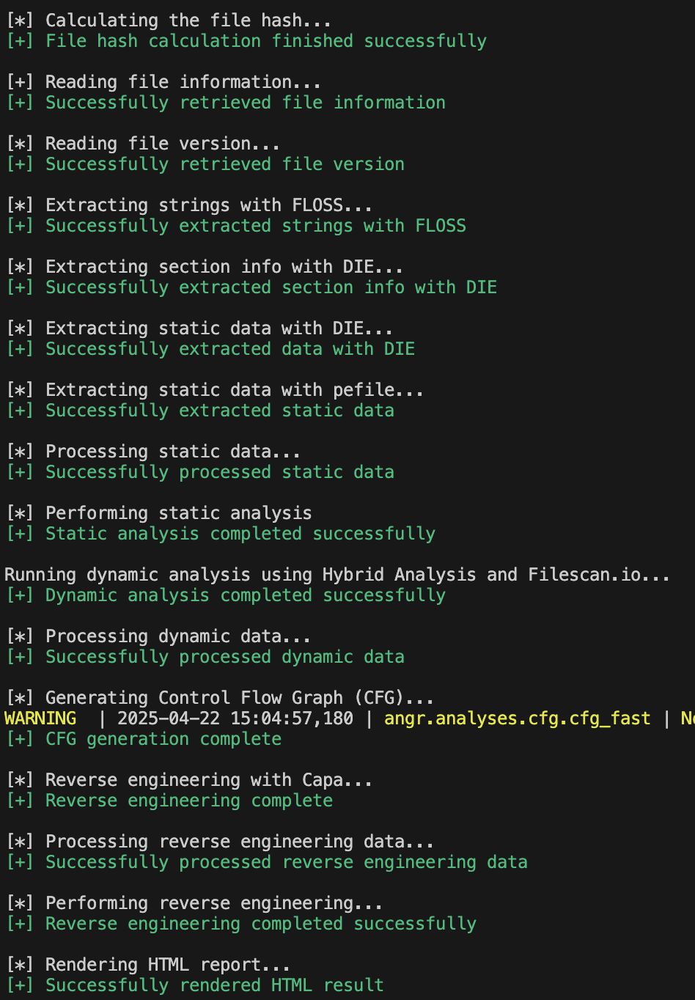
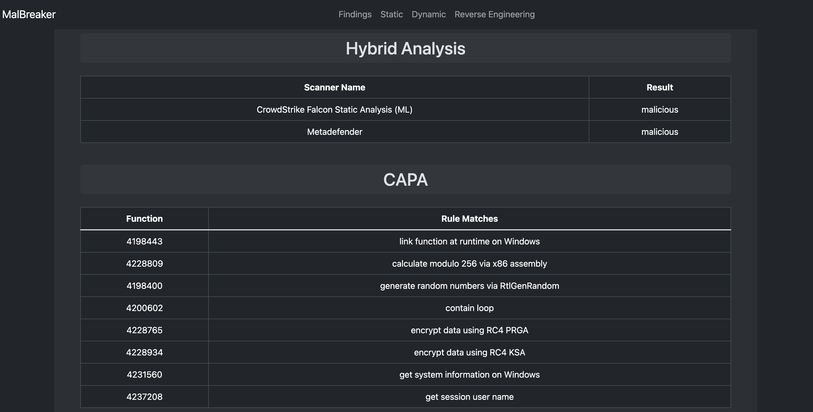

# MalBreaker

**MalBreaker** (short for *malware breaker*) is a tool I wrote as part of my bachelor thesis. It aims to automate a large portion of malware analysis, which can be tedious when a detailed inspection is required. This is currently more of a proof of concept (PoC), as I wanted to assess how far a relatively quickly written malware automation tool could go — so bugs and unexpected behavior are to be expected.

Currently, **MalBreaker** can provide a fair assessment of suspicious software by performing static and limited dynamic analysis, along with basic reverse engineering. It works by chaining together several popular tools (see [Credits](#credits)) and also includes some custom logic. Limitations are detailed in the [Limitations](#limitations) section.

---

## 🛠️ Installation

> ⚠️ MalBreaker is a PoC and was only tested on **Windows 11**.

### Requirements

- [Python 3.13](https://www.python.org/)
- [Chocolatey](https://chocolatey.org/)

### Steps

#### 1. Clone the Repository
```bash
git clone https://github.com/YOUR_USERNAME/MalBreaker.git
cd MalBreaker
```

#### 2. Create a Virtual Environment
```bash
python -m venv venv
venv\Scripts\activate
```

#### 3. Install required libraries/tools from GitHub:
- [pefile](https://github.com/erocarrera/pefile)
    
- [Detect It Easy (DIE)](https://github.com/horsicq/Detect-It-Easy)
    
- [vt-py (VirusTotal)](https://github.com/VirusTotal/vt-py)
    
- [angr](https://github.com/angr/angr)

#### 4. Download binary releases of:
- [FLOSS](https://github.com/mandiant/flare-floss)
        
- [CAPA](https://github.com/mandiant/capa)

## 🚀 Usage

#### 1. Obtain API keys for:
    
- VirusTotal     
- AbuseIPDB
- ThreatBook
- MetaDefender
- HybridAnalysis
- Filescan.io
    
#### 2. Open settings.json and fill in the keys appropriately
An internet connection is required both for API calls and to render the Bootstrap-based HTML report.
    
#### 3. Run analysis:
```bash
python MalBreaker.py -t SUSPICIOUS_FILE_PATH
```

#### 4. For more options:
```bash
python MalBreaker.py -h
```

After analysis completes, an HTML report will be generated inside the data directory, within a subfolder named after the exact date and time (formatted as YYYY-MM-DD_HH-MM) when the analysis was started. Open the HTML file in a browser to view the results.  


> 📷 **Successful Run Screenshot**  
> 

> 📷 **HTML Result Screenshot**  
> 

The CAPA result table includes clickable function offsets that scroll to the corresponding reverse-engineered function in the HTML report.

## ⚠️ Limitations

MalBreaker is a **proof of concept**, so several limitations exist:

- **No analysis customization**: All analyses run by default, with no option to toggle individual steps.
    
- **Lack of robustness**: If the malware is packed or analysis fails, the tool doesn’t stop or notify you.
    
- **Language limitations**: Only works with C/C++ binaries. No support for scripts or suspicious documents.
    
- **Basic dynamic analysis**: Only checks whether HybridAnalysis and Filescan.io flag the sample as malicious. It’s slow (1–2 minutes) and not very insightful for known malware.


## 📝 TODO

- Restructure code & improve quality
    
- Add better error handling
    
- Support toggling analysis types via flags
    
- Implement logic to detect failure scenarios (e.g., packed files)
    
- Enhance current features
    
- Support filetype-specific logic and detection
    
- Add an installation script
    
- Implement **MalBRules**: a custom rules engine for advanced logic
    
- Long-term: Develop **MalBSandbox** (DFIR sandbox environment) — already in progress

## Credits

These tools are the core of MalBreaker. I highly recommend checking them out to learn more about malware analysis and reverse engineering:

- [pefile](https://github.com/erocarrera/pefile)
    
- [Detect It Easy (DIE)](https://github.com/horsicq/Detect-It-Easy)
    
- [vt-py](https://github.com/VirusTotal/vt-py)
    
- [angr](https://github.com/angr/angr) – especially check the [documentation](https://docs.angr.io/en/latest/quickstart.html)
    
- [FLOSS](https://github.com/mandiant/flare-floss)
    
- [CAPA](https://github.com/mandiant/capa)

Special thanks to my thesis advisor for helping me choose the name and guide the project development.